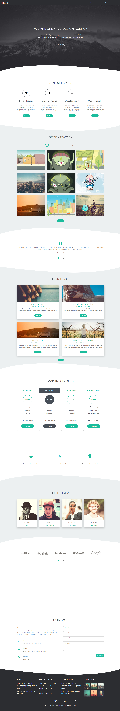

# The-7-Website
The-7-Website is a web application that I developed to enhance my proficiency in HTML and CSS. This project reflects my commitment to independent learning and experimentation in the realm of web development.

## Features
- **Sleek and Modern Design**: The-7-Website boasts a contemporary and sophisticated design, providing users with a visually appealing experience.
- **Responsive Layout**: The application is crafted to ensure a seamless and responsive layout across various devices, optimizing user engagement.
- **Customizable Components**: Explore the customization potential of The-7-Website, where various components can be easily tailored to suit diverse preferences.
Dive into the Experience

Feel free to delve into The-7-Website to experience its design and functionalities firsthand. Your insights and suggestions are invaluable as I continue refining and expanding upon this project. Should you have any inquiries or recommendations, please feel free to get in touch.

**Happy coding!** 🌐✨

